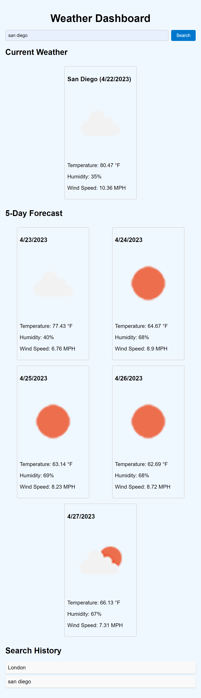

# Weather-Dashboard-5-Day

## Description

This is a weather dashboard that allows the user to search for a city and see the current weather and the 5 day forecast. The user can also see their search history and click on the city to see the weather again.

https://mattlombard.github.io/Weather-Dashboard-5-Day/

## Collaboraters

Isaiah Galarza and Sarah Miller
